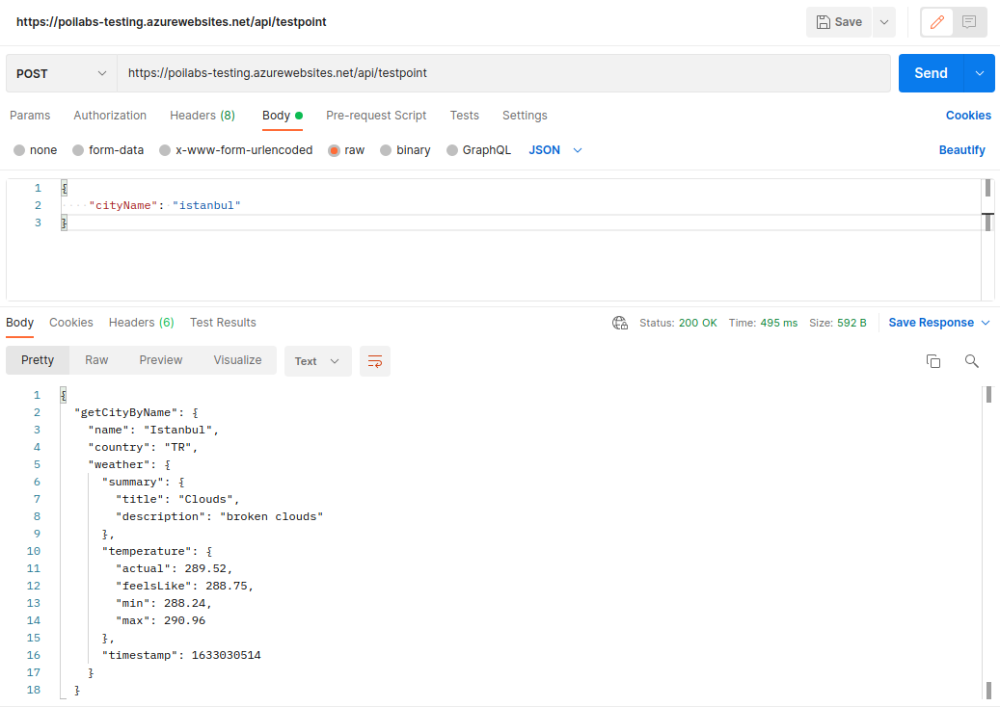

# Azure Nodejs Function Example

The graphql-weather-api which is a graphql service is converted a RESTful service using with the graphql-request module.

GraphQL Weather API:
https://graphql-weather-api.herokuapp.com/

**Query Example:**

```
{
    getCityByName(name: "London") {
      id
      name
      country
      coord {
        lon
        lat
      }
      weather {
        summary {
          title
          description
          icon
        }
        temperature {
          actual
          feelsLike
          min
          max
        }
        wind {
          speed
          deg
        }
        clouds {
          all
          visibility
          humidity
        }
        timestamp
      }
    }
  }
```

**Result:**

```
{
  "getCityByName": {
    "id": "2643743",
    "name": "London",
    "country": "GB",
    "coord": {
      "lon": -0.1257,
      "lat": 51.5085
    },
    "weather": {
      "summary": {
        "title": "Clouds",
        "description": "overcast clouds",
        "icon": "04n"
      },
      "temperature": {
        "actual": 287.89,
        "feelsLike": 287.82,
        "min": 286.75,
        "max": 288.73
      },
      "wind": {
        "speed": 7.16,
        "deg": 216
      },
      "clouds": {
        "all": 100,
        "visibility": 10000,
        "humidity": 92
      },
      "timestamp": 1633028721
    }
  }
}
```

## Service Features

It is possible to query the weather information of the desired city in the world with this service. Body payload view is as follows.

```JSON
{
    "cityName": "London",
    "detail": true
}
```

This Azure service of function only allow POST requests. If you send a request other than POST, you will get the following message.

```
status: 403
body: Forbidden request (only allow POST request)
```

If you want to get short weather information, the following usage is suitable.

```JSON
{
    "cityName": "London",
    "detail": false
}
```

or

```JSON
{
    "cityName": "London"
}
```

**Results:**



## The Table of Response

| Response | Description |
| :- | :- |
| 200 | Successfully get weather info |
| 403 | Forbidden request (only allow POST request) |
| 404 | Not found city name! |
| 405 | Forgotten city name! {cityName:'istanbul'} |
| 500 | Server error message |

## Sources

https://docs.microsoft.com/en-us/azure/azure-functions/functions-reference-node?tabs=v2